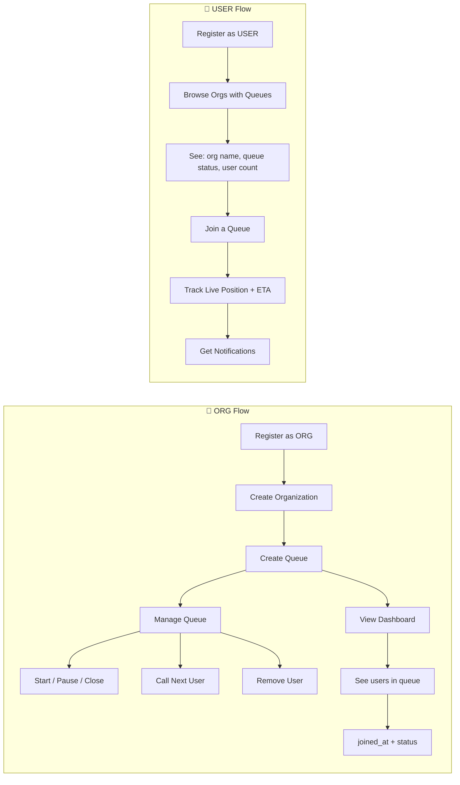
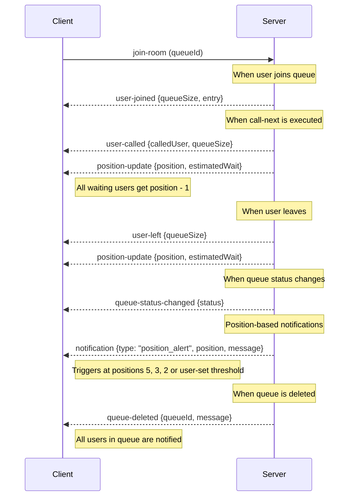

# 🚀 QueueX — Implementation Plan

## Tech Stack Decisions

| Layer | Technology | Rationale |
|-------|-----------|-----------|
| **Backend** | Node.js + Express.js | Fast, event-driven, great for real-time |
| **Real-Time** | Socket.IO | Bi-directional WebSocket communication |
| **Database** | PostgreSQL + Prisma ORM | Type-safe ORM, migrations, transactions |
| **Frontend** | React (Vite) | Fast dev experience, component-based |
| **Styling** | Vanilla CSS | Full control, premium design system |
| **Auth** | JWT (access + refresh tokens) | Stateless, role-based |
| **Deployment** | Vercel + Render + Supabase | As specified |

---

## Project Structure

```
QueueX/
├── server/                        # Backend
│   ├── prisma/
│   │   └── schema.prisma          # Database schema
│   ├── src/
│   │   ├── index.js               # Entry point (Express + Socket.IO)
│   │   ├── config/
│   │   │   └── db.js              # Prisma client singleton
│   │   ├── middleware/
│   │   │   ├── auth.js            # JWT verification
│   │   │   └── roleGuard.js       # Role-based access control
│   │   ├── routes/                # Route definitions (HTTP layer)
│   │   │   ├── auth.routes.js
│   │   │   ├── org.routes.js
│   │   │   ├── queue.routes.js
│   │   │   └── entry.routes.js
│   │   ├── controllers/           # Request/Response handling
│   │   │   ├── auth.controller.js
│   │   │   ├── org.controller.js
│   │   │   ├── queue.controller.js
│   │   │   └── entry.controller.js
│   │   ├── services/              # Business logic layer
│   │   │   ├── auth.service.js
│   │   │   ├── org.service.js
│   │   │   ├── queue.service.js
│   │   │   └── entry.service.js
│   │   ├── repositories/          # Data access layer (Prisma queries)
│   │   │   ├── user.repository.js
│   │   │   ├── org.repository.js
│   │   │   ├── queue.repository.js
│   │   │   └── entry.repository.js
│   │   └── socket/
│   │       └── handler.js         # Socket.IO event handlers
│   ├── package.json
│   └── .env
│
├── client/                        # Frontend (Vite + React)
│   ├── src/
│   │   ├── main.jsx
│   │   ├── App.jsx
│   │   ├── index.css              # Design system
│   │   ├── context/
│   │   │   ├── AuthContext.jsx
│   │   │   └── SocketContext.jsx
│   │   ├── pages/
│   │   │   ├── Landing.jsx
│   │   │   ├── Login.jsx
│   │   │   ├── Register.jsx
│   │   │   ├── OrgDashboard.jsx
│   │   │   ├── QueueView.jsx      # Admin queue control
│   │   │   ├── JoinQueue.jsx      # Customer join page
│   │   │   └── CustomerTracker.jsx # Live position tracking
│   │   ├── components/
│   │   │   ├── Navbar.jsx
│   │   │   ├── QueueCard.jsx
│   │   │   ├── PositionTracker.jsx
│   │   │   ├── NotificationToast.jsx
│   │   │   └── ProtectedRoute.jsx
│   │   └── utils/
│   │       ├── api.js
│   │       └── socket.js
│   └── package.json
```

> [!TIP]
> **4-Layer Backend Architecture:**
> - **Routes** → Define HTTP endpoints, attach middleware
> - **Controllers** → Parse request, call service, send response
> - **Services** → Business logic, validation, orchestration
> - **Repositories** → Direct Prisma/DB queries (single source of truth for data access)

---

## Database Schema (Prisma)

```mermaid
erDiagram
    User {
        String id PK
        String name
        String email UK
        String password
        Role role "ORG | USER"
        DateTime created_at
    }
    Organization {
        String id PK
        String name
        String description
        String owner_id FK UK
        DateTime created_at
        DateTime updated_at
    }
    Queue {
        String id PK
        String name
        String org_id FK UK
        Int max_capacity
        Float service_rate
        QueueStatus status "ACTIVE | PAUSED | CLOSED"
        DateTime created_at
    }
    QueueEntry {
        String id PK
        String queue_id FK
        String user_id FK
        EntryStatus status "WAITING | CALLED | DONE | LEFT"
        Int notify_at_position "default 3, user-configurable"
        DateTime joined_at
        DateTime called_at
        DateTime completed_at
    }
    User ||--|| Organization : "owns exactly one (ORG role)"
    Organization ||--|| Queue : "has exactly one"
    User ||--o{ QueueEntry : "joins (USER role)"
    Queue ||--o{ QueueEntry : "contains"
```

> [!IMPORTANT]
> **Key Constraints (1:1:1 chain):**
> - `@unique owner_id` on Organization — **one ORG account = one organization**
> - `@unique org_id` on Queue — **one organization = one queue**
> - `@@unique([queue_id, user_id])` on QueueEntry — prevents duplicate joins
> - `@@index([queue_id, joined_at])` — optimized FIFO queries
> - Transactions used for all queue mutations
>
> **User Join Constraints:**
> - **One queue at a time** — a USER can only be in **one** queue at a time (any existing `WAITING` or `CALLED` entry blocks joining another queue)
> - **Active queues only** — USERs can only join queues with status `ACTIVE` (not `PAUSED` or `CLOSED`)

> [!WARNING]
> **Ownership-Based Access Control:**
> - An **ORG** can only view/update **its own** organization and queue — never another org's data
> - A **USER** can only view/update **their own** profile — never another user's data
> - All mutations verify `req.user.id === resource.owner_id` before proceeding

---

## User Flows



---

## API Endpoints

### Auth & Profile
| Method | Endpoint | Description |
|--------|----------|-------------|
| POST | `/api/auth/register` | Register (ORG or USER) |
| POST | `/api/auth/login` | Login → returns JWT |
| GET | `/api/auth/me` | Get own profile |
| PATCH | `/api/auth/me` | Update own profile (name, password) |

### Organization (ORG only — own org only)
| Method | Endpoint | Description |
|--------|----------|-------------|
| POST | `/api/orgs` | Create an organization (one per ORG user) |
| PATCH | `/api/orgs/me` | Update own organization details |

### Queue Management (ORG only — own queue only)
| Method | Endpoint | Description | Response includes |
|--------|----------|-------------|-------------------|
| POST | `/api/orgs/me/queue` | Create the queue for own org (max 1) | queue details |
| GET | `/api/orgs/me/queue` | **ORG Dashboard** — own queue + users | queue details, list of users (name, joined_at, status), total count, currently serving |
| PATCH | `/api/orgs/me/queue/status` | Start / Pause / Close own queue | updated status |
| POST | `/api/orgs/me/queue/call-next` | Call next WAITING user → **broadcasts position-1 to all waiting users** | called user details |
| DELETE | `/api/orgs/me/queue/entries/:entryId` | Remove a user from own queue | — |
| DELETE | `/api/orgs/me/queue` | **Delete queue** → notifies all users in queue | — |

### Queue Discovery (USER — browse available queues)
| Method | Endpoint | Description | Response includes |
|--------|----------|-------------|-------------------|
| GET | `/api/queues` | **Browse all orgs with queues** | org name, queue name, queue status, user count per queue |
| GET | `/api/queues/:id` | Get details of a specific queue | org name, queue name, status, user count, max capacity |

### Queue Actions (USER — join & track)
| Method | Endpoint | Description | Response includes |
|--------|----------|-------------|-------------------|
| POST | `/api/queues/:id/join` | Join a queue (optionally set `notify_at_position`) | entry details, position |
| GET | `/api/queues/:id/position` | Get own position + estimated wait | position, ETA, queue status |
| POST | `/api/queues/:id/leave` | Leave queue voluntarily | — |
| PATCH | `/api/queues/:id/notify` | **Update notification preference** (set custom position threshold) | updated notify_at_position |

---

## WebSocket Events



---

## Queue Logic

1. **FIFO Order**: All positions calculated dynamically via `ORDER BY joined_at ASC` where `status = 'WAITING'`
2. **Position Calculation**: `COUNT(*) WHERE queue_id = X AND status = 'WAITING' AND joined_at < current_user.joined_at`
3. **Wait Time**: `position * (1 / service_rate)` minutes
4. **Call Next**: Find first `WAITING` entry by `joined_at`, update to `CALLED` → **broadcast position-1 to every remaining WAITING user**
5. **Concurrency**: Prisma transactions with serializable isolation for joins and call-next
6. **One Queue Per User**: Before joining, check if the user already has a `WAITING` or `CALLED` entry in **any** queue — if yes, reject with `"You are already in a queue. Leave your current queue before joining another."`
7. **Queue Status Gate**: Before joining, verify `queue.status === 'ACTIVE'` — reject with `"This queue is not accepting new entries"` if `PAUSED` or `CLOSED`

---

## Notification System

### Default Position Alerts
When `call-next` is executed and positions shift, the server checks each waiting user's new position:
| Position | Notification |
|----------|--------------|
| **5** | "Heads up! You're 5th in line — start heading over" |
| **3** | "Almost there! You're 3rd in line" |
| **2** | "Get ready! You're next after the current person" |
| **1** | "You're NEXT! Please be ready" |

### Custom Threshold
- Users can set `notify_at_position` when joining (`POST /api/queues/:id/join`) or later (`PATCH /api/queues/:id/notify`)
- Default value: `3`
- When their position reaches this number → extra notification fired

### Queue Deletion
- When ORG deletes their queue (`DELETE /api/orgs/me/queue`):
  - All WAITING/CALLED entries are set to `LEFT`
  - `queue-deleted` event broadcast to all users in the room
  - Message: "The queue has been closed by the organization"

---

## Build Phases

### Phase 1: Backend Foundation
- [x] Initialize Node.js project with Express
- [x] Set up Prisma with PostgreSQL schema
- [x] Implement auth (register, login, JWT middleware)
- [x] Role-based guard middleware

### Phase 2: Queue API
- [x] Queue CRUD (create, list, get details)
- [x] Queue control (start/pause/close, call-next)
- [x] Queue entry (join, leave, position)
- [x] Transactions & data integrity

### Phase 3: Real-Time Layer
- [x] Socket.IO server setup
- [x] Room-based broadcasting per queue
- [x] Event handlers for all queue mutations
- [x] Position update broadcasts

### Phase 4: Frontend — Auth & Layout
- [x] Vite + React setup
- [x] Design system (CSS variables, components)
- [x] Auth pages (Login, Register)
- [x] Auth context + protected routes

### Phase 5: Frontend — Core Pages
- [x] Org Dashboard (list queues, create queue)
- [x] Queue Control View (admin panel per queue)
- [x] Join Queue page (customer)
- [x] Live Position Tracker (customer)

### Phase 6: Real-Time Integration
- [x] Socket context in React
- [x] Live updates on all pages
- [x] Notification toasts
- [x] Smart wait time display

### Phase 7: Polish
- [x] Landing page with premium design
- [x] Error handling & loading states
- [x] Responsive design
- [x] Final testing

---

> [!NOTE]
> **Design Philosophy**: The UI will feature a premium dark theme with glassmorphism, smooth animations, gradient accents, and modern typography (Inter/Outfit from Google Fonts). Every page will feel polished and production-ready.

Shall I proceed with building? 🚀
